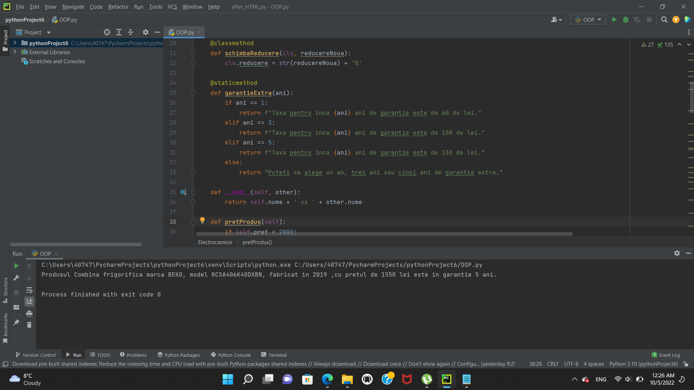
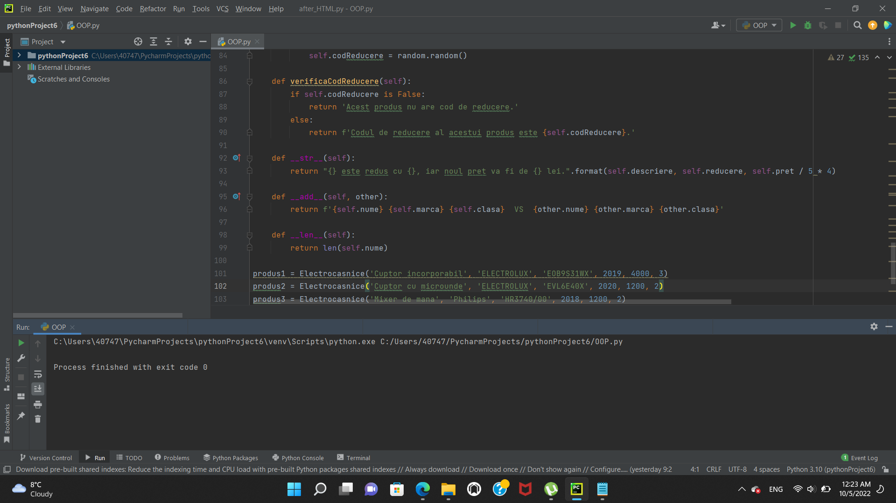

# Proiect OOP in Python

## Despre proiect
In acest am folosit programarea orientata pe obiecte dezvoltand in python o clasa si o clasa mostenitoare pentru echipamente electrocasnice.

## Tehnologiile folosite
* Python

## Cateva imagini din partea de BackEnd

